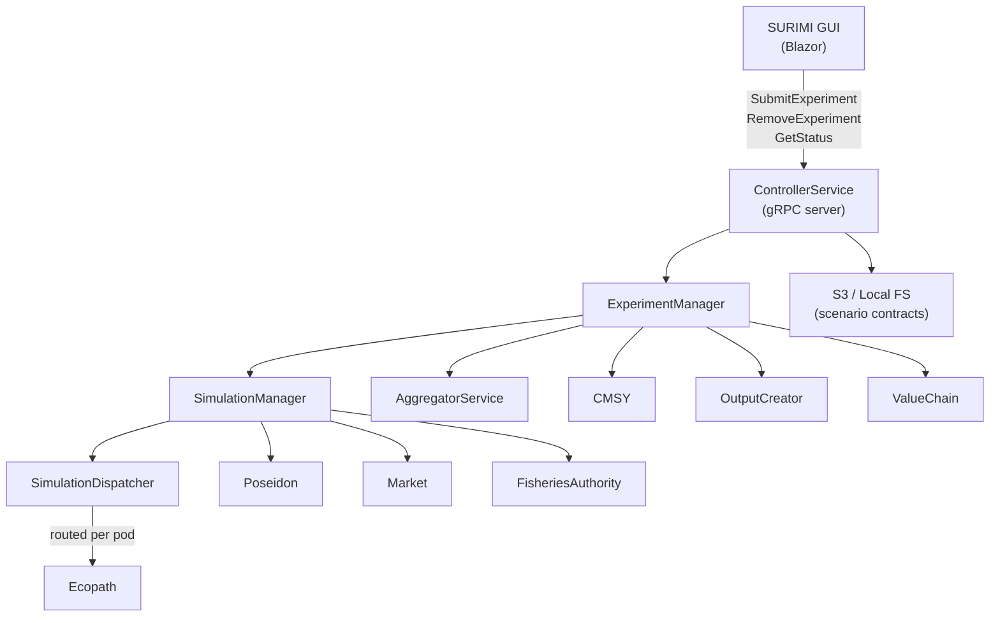
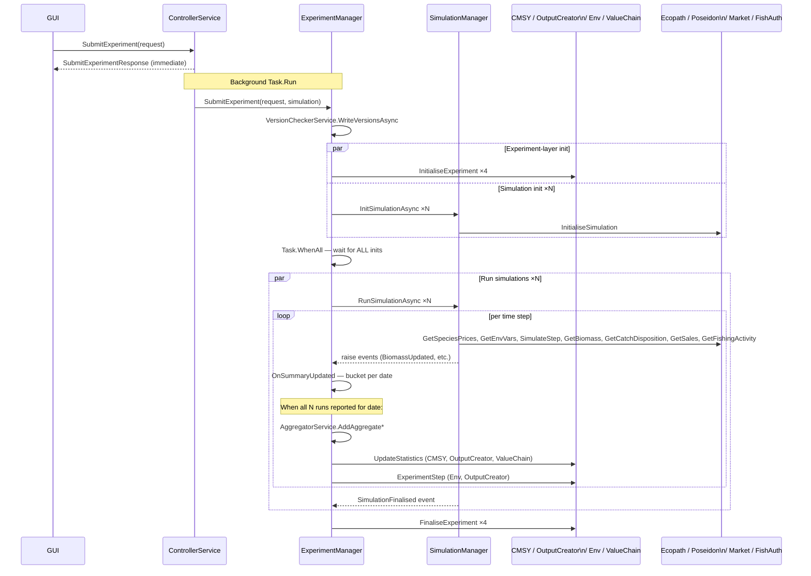
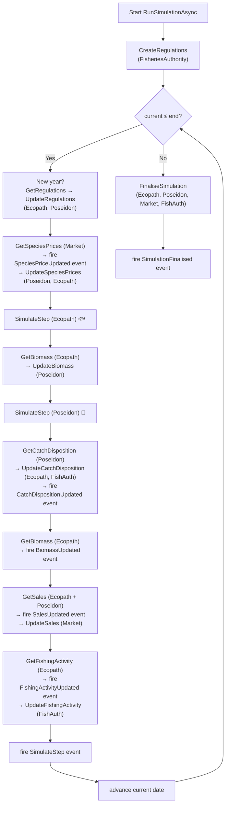
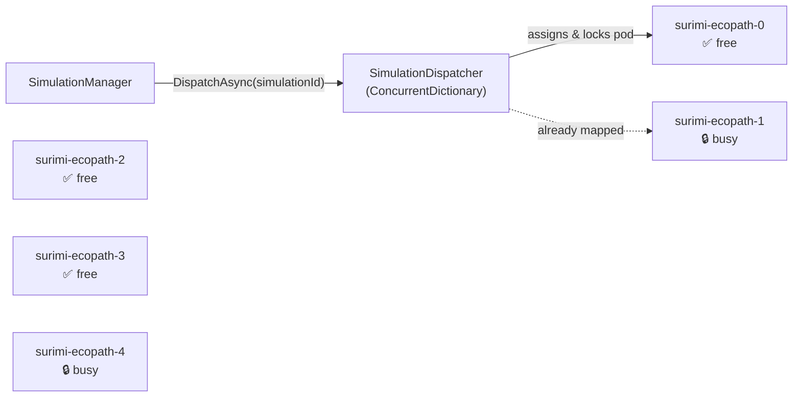
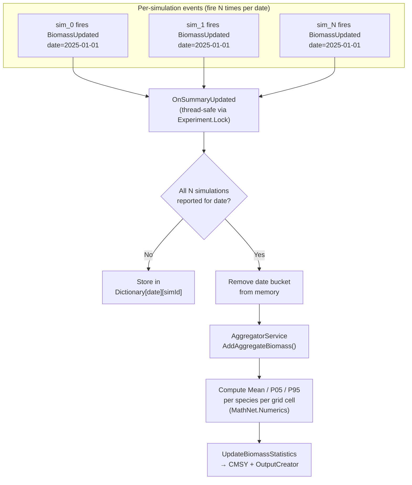
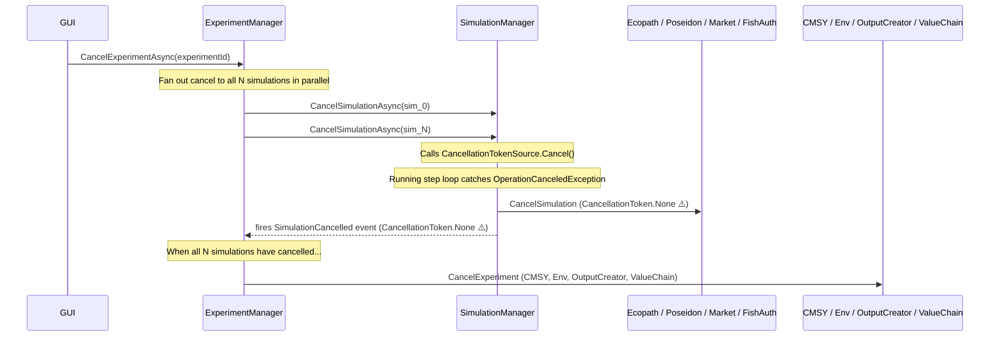
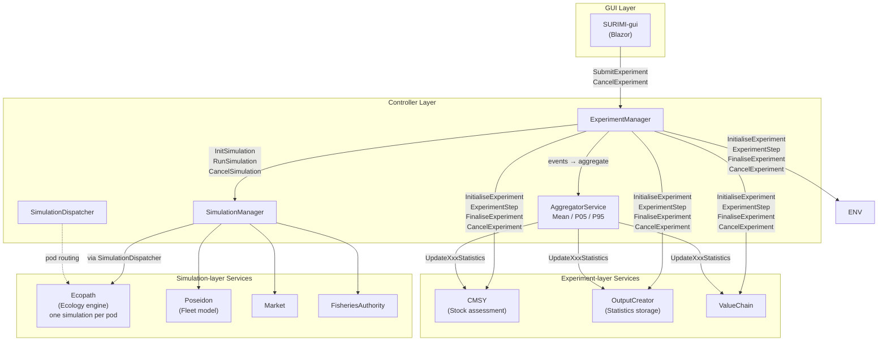
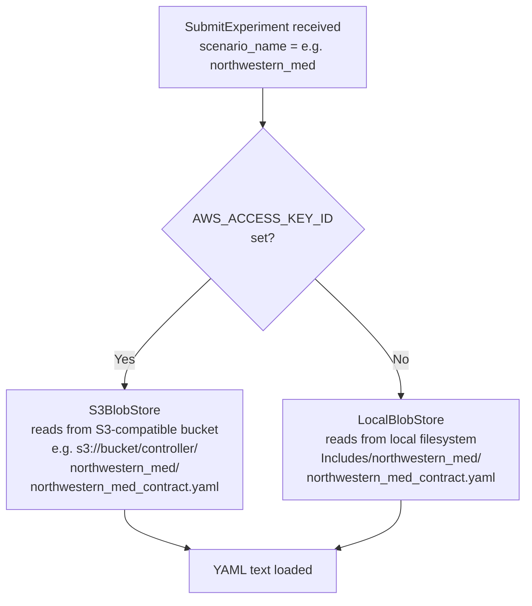
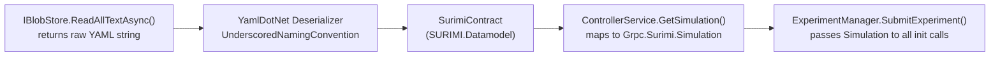
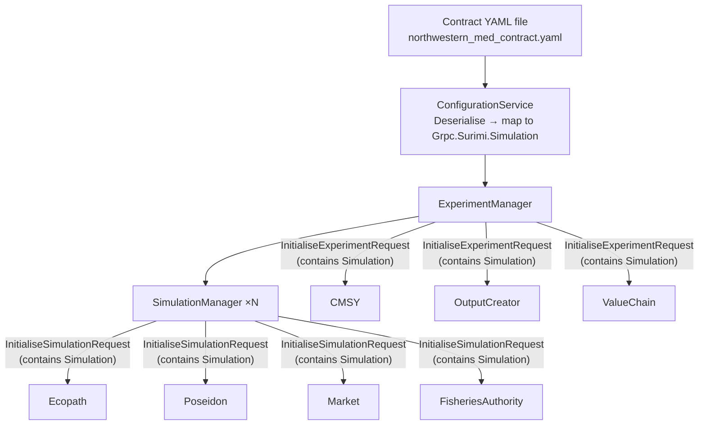

# Controller — Architecture

## Overview

The **SURIMI Controller** is the central orchestrator of the SURIMI system — a Management Strategy Evaluation (MSE) platform for fisheries science. It coordinates multi-simulation experiments across a suite of downstream scientific models (Ecopath, Poseidon, Market, CMSY, FisheriesAuthority, OutputCreator, ValueChain), all of which communicate exclusively with the controller over **gRPC**.

The controller is written in **C# 14 / .NET 10** using ASP.NET Core and is developed in **Microsoft Visual Studio**. Locally it runs inside a **.NET Aspire** application host that simulates the Kubernetes cluster environment.

### Licence

No licence file is present in the repository. The code is proprietary to the SURIMI-project organisation.

---

## Responsibilities

- Expose a gRPC server endpoint to the GUI, accepting experiment submission and cancellation requests.
- Load the **scenario contract** (YAML) from the local filesystem or from an S3-compatible object store and translate it into the shared gRPC `Simulation` message.
  - Fan out **experiment initialisation** calls concurrently to all downstream experiment-layer services (CMSY, OutputCreator, ValueChain).
- Manage N parallel **simulation runs** per experiment; each run is driven through a full time-step loop by `SimulationManager`, which calls simulation-layer services (Ecopath, Poseidon, Market, FisheriesAuthority).
- **Aggregate** per-simulation summaries (biomass, catch disposition, fishing activity, sales, species prices) across all N runs using mean / P05 / P95 statistics, then forward the aggregated result to the appropriate downstream clients.
- Route each simulation run to a dedicated **Ecopath pod** via `SimulationDispatcher`.
- Validate that all connected services are running the expected protocol version before an experiment starts.

### Build outputs

| Binary | Description |
|---|---|
| `SURIMI-controller` (ASP.NET Core web service) | The main controller service. Exposes a gRPC server for the GUI and acts as a gRPC client to all downstream models. Runs on port **5092**. |
| `SURIMI-gui` (Blazor WebAssembly) | Graphical front-end. Not built or pushed by the controller CI pipeline; must be built manually. |

---

## Interfaces

### Lifecycle messages (server-side — received from the GUI)

| Message | Description |
|---|---|
| `SubmitExperiment` | Starts a new multi-simulation experiment; returns immediately while the work continues in the background. |
| `RemoveExperiment` | Cancels a running experiment and all its simulation runs. |

### Query messages (server-side — received from the GUI)

| Message | Description |
|---|---|
| `GetAllSimulationStatuses` | Returns the current status of every known simulation. |
| `GetSimulationContract` | Returns the parsed `Simulation` contract (default scenario) so the GUI can inspect available configuration. |
| `GetProtocolVersion` | Returns the protocol version the controller was compiled against. |

### Outbound gRPC calls (client-side — sent to downstream models)

| Downstream | Messages called |
|---|---|
| **CMSY** | `InitialiseExperiment`, `UpdateBiomassStatistics`, `UpdateCatchDispositionStatistics`, `ExperimentStep`, `FinaliseExperiment`, `CancelExperiment` |
| **OutputCreator** | `InitialiseExperiment`, all `UpdateStatistics` messages, `ExperimentStep`, `FinaliseExperiment`, `CancelExperiment` |
| **ValueChain** | `InitialiseExperiment`, `UpdateSalesStatistics`, `FinaliseExperiment`, `CancelExperiment` |
| **Ecopath** | `InitialiseSimulation`, `UpdateRegulations`, `UpdateBiomass`, `UpdateCatchDisposition`, `UpdateSpeciesPrices`, `SimulateStep`, `GetBiomass`, `GetCatchDisposition`, `GetSales`, `GetFishingActivity`, `FinaliseSimulation` |
| **Poseidon** | `InitialiseSimulation`, `UpdateBiomass`, `UpdateCatchDisposition`, `UpdateSpeciesPrices`, `UpdateRegulations`, `SimulateStep`, `GetCatchDisposition`, `GetSales`, `FinaliseSimulation` |
| **Market** | `InitialiseSimulation`, `GetSpeciesPrices`, `UpdateSales`, `FinaliseSimulation` |
| **FisheriesAuthority** | `InitialiseSimulation`, `CreateRegulations`, `GetRegulations`, `UpdateCatchDisposition`, `UpdateFishingActivity`, `FinaliseSimulation` |

---

## Model theory

SURIMI implements **Management Strategy Evaluation (MSE)** — a fisheries science method in which the same scenario is executed N times in parallel (Monte Carlo style), each with slightly different stochastic perturbations. Comparing the spread of outcomes across runs produces probabilistic confidence intervals (e.g. mean biomass ± P05–P95) that inform regulatory decision-making. The controller materialises this by mapping one *Experiment* to N concurrent *Simulations*, waiting for every run to report results for a given date before aggregating and forwarding the combined statistics.

---

## Service architecture

`ControllerService` is the single gRPC server endpoint; it delegates all experiment work to `ExperimentManager`. `ExperimentManager` launches experiment-layer initialisation and all N simulation initialisations concurrently via `Task.WhenAll`, and only starts the simulation run loop after every initialisation succeeds. `SimulationManager` drives each individual run through a sequential time-step loop, raising C# events after each data exchange so that `ExperimentManager` can collect, bucket, and aggregate the results. Once all N simulations have reported in for a date, `AggregatorService` computes mean/P05/P95 statistics using MathNet.Numerics and the results are forwarded to the appropriate downstream clients. Ecopath — the computationally intensive ecology engine — is routed to a dedicated pod by `SimulationDispatcher`, which maintains a `ConcurrentDictionary` of pod availability.

### High-Level Architecture



### Message flow



### Key design decisions / trade-offs

| Decision | Rationale |
|---|---|
| `SubmitExperiment` returns immediately | Avoids gRPC deadline timeout during long-running experiments; all work runs in a background `Task`. |
| No Polly retry on gRPC clients | Calls are stateful and non-idempotent (e.g. `InitialiseExperiment`). Retrying silently would corrupt downstream state. |
| `CancellationToken.None` in cleanup paths | When a `CancellationTokenSource` has already been cancelled, passing the cancelled token to subsequent gRPC calls causes immediate `StatusCode.Cancelled` failures before reaching the wire. Cleanup calls use `CancellationToken.None` instead. |
| `SimulationDispatcher` pod router | Ecopath can only run one simulation per pod; the dispatcher assigns each `simulationId` to a free pod and keeps it pinned for the lifetime of the simulation. |
| `PoseidonServiceClient` registered as singleton | Poseidon maintains state about which fishery models are currently loaded; a singleton ensures that state is shared correctly across calls. |
| `PooledConnectionLifetime = 5 min` | Forces periodic DNS re-resolution so that connections to restarted pods in Kubernetes are not stale. |
| all N simulation inits are launched **concurrently** | Experiment-layer inits and all N simulation inits are launched **concurrently** using `Task.WhenAll` to maximize parallelism and reduce overall initialization time. |
| `RunSimulationAsync` is only called after **every single** init task has completed successfully | If any init fails, the whole experiment fails (exception is logged and re-thrown). |
| Any init failure causes the experiment to fail | If any init fails, the whole experiment fails (exception is logged and re-thrown). |

---

### Per-Simulation Step Loop

Each simulation runs an independent time-step loop inside `SimulationManager.RunSimulationAsync`. The steps within one simulation are sequential (each call depends on the previous result), but the N simulations run **in parallel with each other**.



---

### Ecopath and the SimulationDispatcher

Ecopath is a computationally intensive ecological modelling engine that can only **run one simulation at a time per process instance**. In the Kubernetes cluster, multiple Ecopath pods are deployed (e.g. `surimi-ecopath-0` … `surimi-ecopath-4`) to allow parallel simulations.

`SimulationDispatcher` acts as a **pod router**:



**Routing rules:**
1. On the **first call** for a `simulationId`, find the first available pod (`podAvailability[pod] == true`).
2. Resolve the pod's DNS address; if DNS resolution fails, throw `StatusCode.Unavailable` (triggers retry in `DispatchWithRetryAsync`).
3. Mark the pod as **busy** (`podAvailability[pod] = false`) and record the mapping in `simulationToPodMap`.
4. On **subsequent calls** for the same `simulationId`, reuse the **same** pod.
5. When the simulation ends or is cancelled, `ReleasePodFromSimulation` sets the pod back to **available**.

> **Dev mode:** When `ECOPATH_URL` does not contain `"pod"` (i.e. running on a developer machine pointing at `localhost`), the dispatcher skips address replacement and DNS checks entirely.

---

### Date-Bucketed Aggregation

Each simulation fires events (`BiomassUpdated`, `CatchDispositionUpdated`, etc.) independently as it completes a time step. `ExperimentManager` must wait until **all N simulations** have reported for the same date before computing statistics.



**Thread safety:** All writes to the per-date dictionaries are protected by `Experiment.Lock` (a C# 13 `Lock` object). The `onAllReceived` callback is fired *outside* the lock to avoid holding it during async gRPC calls.

**Memory management:** Date buckets are removed immediately after aggregation — the controller never accumulates unbounded state.

---

### Aggregated Statistics: What Gets Computed

`AggregatorService` computes three statistics for every numeric field across the N simulation results:

| Statistic | Meaning |
|---|---|
| **Mean** | Expected value of the outcome |
| **P05** (5th percentile) | Pessimistic bound — only 5% of runs fall below this |
| **P95** (95th percentile) | Optimistic bound — only 5% of runs exceed this |

The Mean + P05/P95 band represents the **robustness envelope** of the management strategy.

#### Spatial data (Biomass, CatchDisposition)
Iterates every `(latitude, longitude)` cell that appears in *any* simulation, collecting values from all runs (missing cells treated as `0`), then computes statistics with `MathNet.Numerics.Statistics`.

#### Non-spatial data (FishingActivity, Sales, SpeciesPrice)
Uses `DistinctBy` on the relevant composite key (fleet segment, species, market) and a direct LINQ loop to collect scalar values across runs.

#### UpdateStatistics recipients

| Event | Receives aggregated statistics |
|---|---|
| `BiomassUpdated` | CMSY, OutputCreator |
| `CatchDispositionUpdated` | CMSY, OutputCreator |
| `FishingActivityUpdated` | OutputCreator |
| `SalesUpdated` | OutputCreator, ValueChain |
| `SpeciesPriceUpdated` | OutputCreator |

Only **experiment-layer** clients receive statistics messages. The individual simulation-layer services (Ecopath, Poseidon, Market, FisheriesAuthority) never see aggregated output.

---

### Excluding Clients

Individual service clients implement `ISimulationService.AddInitialise`, which can add an initialisation task to the wait list, if it is not excluded. This means a client can be **excluded from an experiment run** without code changes — only its enabled/disabled configuration needs to be toggled by setting an environment variable, LIKE "EXCLUDE_VALUECHAIN". Disabled clients are silently skipped during every phase: init, step, finalise, and cancel. The exception is POSEIDON. It is excluded automatically depending on the existance of a model with the name "POSEIDON" in the list of Fleet segments in the contract.

---

### Cancellation

Cancellation can be triggered at any time via `CancelExperimentAsync`.



> ⚠️ **Important:** Once the `CancellationTokenSource` has been cancelled, all subsequent cleanup gRPC calls use `CancellationToken.None`. Reusing the already-cancelled token would cause those calls to fail immediately with `StatusCode.Cancelled` before reaching the wire — the cleanup messages would never be delivered.

Pending `SimulateStep` and summary events that arrive after cancellation are **silently dropped** — the guard `!e.Token.IsCancellationRequested` prevents partial statistics from being forwarded during a cancel.

---

### Full Architecture Diagram



---

### The SURIMI Contract

#### Purpose

Before any simulation can start, every service must agree on a shared set of domain rules: which species exist, which fleet segments operate, which markets and currencies are in scope, what the spatial grid looks like, what the time range is, and which unit standards to use. This shared agreement is called the **SURIMI Contract**. It is a YAML file that is authoritative for one scenario.

A mismatch between a service's internal configuration and the contract (e.g. an unknown species code, an unsupported fleet segment) causes that service to throw a gRPC exception during initialisation, which immediately aborts the experiment.

#### Scenarios

SURIMI ships with three named scenarios, each with its own contract file:

| Scenario name | Description |
|---|---|
| `northwestern_med` | North-Western Mediterranean case study |
| `aegean_sea` | Aegean Sea case study |
| `anchovy_bay` | Anchovy Bay case study |

The scenario to use is supplied by the GUI as the `scenario_name` field of the `SubmitExperimentRequest`.

#### Where the Contract File Lives

The contract file is resolved at runtime via `IBlobStore`, which abstracts over two storage backends depending on the environment:



| Environment variable | Presence | Effect |
|---|---|---|
| `AWS_ACCESS_KEY_ID` | Set | S3-compatible storage is used (`AWS_S3_ENDPOINT`, `AWS_SECRET_ACCESS_KEY`, `AWS_BUCKET_NAME` also required) |
| `AWS_ACCESS_KEY_ID` | Absent / empty | Falls back to the local `Includes/` directory (developer mode or disconnected environment) |

The file path pattern is always: `{scenarioName}/{scenarioName}_contract.yaml` — e.g. `northwestern_med/northwestern_med_contract.yaml`.

If the file cannot be found in either location, a `StatusCode.Internal` gRPC exception is thrown immediately and the experiment does not start.

#### Loading and Deserialisation

`ConfigurationService.ReadConfigurationAsync` handles the full loading pipeline:



1. The YAML is deserialised by **YamlDotNet** using `UnderscoredNamingConvention` (snake_case keys map to PascalCase C# properties).
2. `ControllerService.GetSimulation()` maps the `SurimiContract` (SURIMI.Datamodel types) to the `Grpc.Surimi.Simulation` protobuf message. This includes geography, time range, standards, species list, fleet segments, markets, currencies, and price categories.
3. The resulting `Simulation` message is passed to `ExperimentManager.SubmitExperiment()`, which includes it verbatim in every `InitialiseExperimentRequest` (experiment-layer) and every `InitialiseSimulationRequest` (simulation-layer).

#### Contract Distribution

Once deserialised and mapped, the contract is broadcast to all services during the initialisation phase (see §4):



Every service — both experiment-layer and simulation-layer — receives the full `Simulation` message as part of its `Initialise` call. If a service cannot satisfy the contract (unknown species, unsupported gear, incompatible grid resolution, etc.) it throws a gRPC exception. Because all init calls are awaited via `Task.WhenAll`, a single failure aborts the entire experiment before any simulation step is ever executed.

---

## Error handling

- `ExceptionMetadataInterceptor` (from `SURIMI.Common`) is registered on the server-side gRPC pipeline and converts unhandled exceptions into structured gRPC error responses with metadata trailers.
- `GrpcErrorDetailLoggingInterceptor` is attached to every outbound gRPC client. It reads the `grpc-status-details-bin` trailer on failure, logs full error detail, and re-throws. `StatusCode.Cancelled` is logged at `Information` (intentional signal during cancel flow); all other unexpected statuses are logged at `Error`.
- Experiment and simulation init failures are logged with `_logger.LogError` and the background task re-throws, causing the experiment to enter a failed state.
- Optional downstream clients (controlled by environment variable flags) are silently skipped when disabled.

---

## Logging

Logging is configured in `Program.cs` using `AddSimpleConsole` with a `[HH:mm:ss]` timestamp prefix. All standard ASP.NET Core and HTTP client noise (`Microsoft.AspNetCore`, `System.Net.Http.HttpClient`, `Polly`) is suppressed to `Warning`. All application code uses structured `ILogger<T>` with named placeholders such as `{ExperimentId}`, `{SimulationId}`, `{Date}`. At startup, all environment variables are logged at `Information` level for diagnostics.

---

## S3 bucket

The controller reads **scenario contract YAML files** from an S3-compatible object store at runtime. These files (e.g. `northwestern_med/northwestern_med_contract.yaml`) describe the full simulation configuration: geography, species, fleet segments, markets, currencies, time range, and standards. In local / development mode the files are read from the `Includes/` directory on disk; when `AWS_ACCESS_KEY_ID` is set the `Eii.BlobStore.S3` adapter is used instead.

The contracts are kept in sync with the `SURIMI-data_preprocessing` repository by a nightly GitHub Actions workflow (`sync-surimi-contracts.yml`) that opens a PR if contract files have changed.

### S3 bucket authentication

Long-lived AWS credentials (`AWS_ACCESS_KEY_ID` / `AWS_SECRET_ACCESS_KEY`) are retrieved at container startup from **HashiCorp Vault** via `VaultService`. `VaultService` reads the Vault address and token from environment variables, fetches the secrets, and injects them back into the process environment before the `IBlobStore` singleton is first used. This means the container image itself never contains credentials; they are injected at runtime from the cluster's Vault instance.

---

## Kubernetes

The controller is deployed as a pod in the **EDITO Datalab Kubernetes cluster**. It connects to all downstream model pods by URL, using environment variables for service discovery. Ecopath is a special case: multiple pods (`surimi-ecopath-0` … `surimi-ecopath-N`) run in parallel and the controller's `SimulationDispatcher` routes each simulation to a free pod. The `POD_NAMESPACE` environment variable is substituted into the Ecopath URL template so that the correct namespace is used per deployment environment (e.g. `user-rikkert`, `project-surimi`).

---

## Environment

| Variable | Purpose |
|---|---|
| `POSEIDON_URL` | Base address of the Poseidon gRPC service |
| `MARKET_URL` | Base address of the Market gRPC service |
| `CMSY_URL` | Base address of the CMSY stock-assessment gRPC service |
| `VALUECHAIN_URL` | Base address of the ValueChain gRPC service |
| `FISHERIES_AUTHORITY_URL` | Base address of the FisheriesAuthority gRPC service |
| `OUTPUT_CREATOR_URL` | Base address of the OutputCreator gRPC service |
| `ECOPATH_URL` | URL template for Ecopath pods (contains `namespace` placeholder) |
| `ECOPATH_NR_OF_PODS` | Number of Ecopath pods available for dispatch |
| `POD_NAMESPACE` | Kubernetes namespace; substituted into the Ecopath URL template |
| `AWS_ACCESS_KEY_ID` | S3-compatible storage access key (triggers S3 mode when set) |
| `AWS_SECRET_ACCESS_KEY` | S3-compatible storage secret key |
| `AWS_S3_ENDPOINT` | S3-compatible endpoint URL |
| `AWS_BUCKET_NAME` | S3 bucket name for reading scenario contracts |
| `VAULT_*` | Vault address / token (consumed by `VaultService` to retrieve AWS credentials) |
| `ASPNETCORE_HTTP_PORTS` | Kestrel listen port (default `5092`) |
| `OTEL_EXPORTER_OTLP_ENDPOINT` | OpenTelemetry collector endpoint |
| `OTEL_SERVICE_NAME` | Service name reported to OTLP (`surimi-controller`) |

---

## CI/CD

### Workflows

| Workflow | Trigger | Action |
|---|---|---|
| **Build Check** (`build-check.yml`) | Pull request → `master` | Runs a dotnet build using the shared `Eii.GithubActions/BuildCheckUbuntuBSR` action, authenticating against the Buf Schema Registry (BSR) with `BSR_TOKEN`. |
| **Build and Push Docker Image** (`docker.yml`) | Push → `master` | Builds the controller Docker image using `SURIMI-controller/Dockerfile`, passing `GITHUB_TOKEN` (for GitHub Packages) and `BSR_TOKEN` (for BSR) as BuildKit secrets. Pushes to GHCR. |
| **Sync SURIMI contract inputs** (`sync-surimi-contracts.yml`) | Nightly (02:00 UTC) + manual | Checks out `SURIMI-data_preprocessing` (with Git LFS), compares `SURIMI-contracts/` with `SURIMI-controller/Includes/`, and opens a PR if any contracts have changed. |

### Docker images

| Image | Registry | Tag |
|---|---|---|
| `surimicontroller` | `ghcr.io/surimi-project/surimicontroller` | `latest` |

The GUI image is **not** built by CI. It must be built and pushed manually:

```bash
dotnet build /t:BuildPushDockerImage -v:detailed
```

---

## Technology stack

| Package | Role |
|---|---|
| `BSR.Surimi.Surimi-Protocol.Grpc.Csharp` | Generated gRPC stubs for all SURIMI services (sourced from the Buf Schema Registry) |
| `Grpc.AspNetCore` | gRPC server hosting on ASP.NET Core (Kestrel, HTTP/2) |
| `Grpc.StatusProto` | Structured gRPC error details via the `google.rpc.Status` proto |
| `MathNet.Numerics` | Statistical aggregation — mean, 5th-percentile (P05), 95th-percentile (P95) |
| `Eii.BlobStore` | Abstraction layer for reading/writing files from local filesystem or S3 |
| `Eii.BlobStore.S3` | S3-compatible storage adapter (MINIO / AWS) used in production |
| `SURIMI.Common` | Shared gRPC interceptors (`ExceptionMetadataInterceptor`, `VersionMetadataInterceptor`), `ProtocolVersionService` |
| `SURIMI.Datamodel` | Shared C# data model / YAML contract types (`SurimiContract`, `Species`, `FleetSegment`, …) |
| `YamlDotNet` | YAML deserialisation of scenario contract files |
| `Microsoft.VisualStudio.Azure.Containers.Tools.Targets` | Visual Studio Docker tooling (fast-mode debug container) |

---

## Project structure

```
SURIMI-controller.sln
├── SURIMI-controller/               # Core gRPC controller service
│   ├── Program.cs                   # DI wiring, gRPC client registration, Kestrel config
│   ├── Dockerfile                   # Multi-stage Docker build
│   ├── appsettings.json
│   ├── Models/                      # Event-arg and domain model types
│   │   ├── Experiment.cs            # Per-experiment state (simulation IDs, summary buckets)
│   │   ├── Simulation.cs            # Per-simulation state
│   │   ├── BiomassEventArgs.cs
│   │   ├── CatchDispositionEventArgs.cs
│   │   ├── FishingActivityEventArgs.cs
│   │   ├── SalesEventArgs.cs
│   │   ├── SpeciesPricesEventArgs.cs
│   │   └── ExperimentEventArgs.cs
│   ├── Services/
│   │   ├── ControllerService.cs     # gRPC server — entry point from GUI
│   │   ├── ExperimentManager.cs     # Central orchestrator; event wiring and aggregation dispatch
│   │   ├── SimulationManager.cs     # Per-simulation time-step loop
│   │   ├── AggregatorService.cs     # Mean/P05/P95 statistics across N runs
│   │   ├── SimulationDispatcher.cs  # Routes simulations to free Ecopath pods
│   │   ├── ConfigurationService.cs  # Reads scenario YAML from disk or S3
│   │   ├── VersionCheckerService.cs # Validates protocol versions of connected services
│   │   ├── GrpcErrorDetailLoggingInterceptor.cs
│   │   └── ServiceClients/          # One client class per downstream service
│   └── Includes/                    # Bundled scenario contract YAML files (local dev)
│       ├── northwestern_med/
│       ├── anchovy_bay/
│       └── aegean_sea/
├── SURIMI-gui/                      # Blazor front-end
├── SURIMI.AppHost/                  # .NET Aspire host (local dev / debugging)
├── SURIMI.Controller.Tests/         # xUnit unit tests
└── docs/
    └── simulation-architecture.md   # Detailed MSE / simulation lifecycle documentation
```

---

## Source control

Git is used for source control, hosted on **GitHub** at `github.com/surimi-project/SURIMI-controller`.

The gRPC **protocol definitions** (`.proto` files) live in the separate [`SURIMI-protocol`](https://github.com/surimi-project/SURIMI-protocol) repository and are consumed as a NuGet package from the Buf Schema Registry (BSR) and GitHub Packages — not as a submodule. The remote alias `surimi-protocol` in the controller repo is used to track upstream protocol changes.

Branch protection is enforced on `master`; all changes must go through a pull request that passes the **Build Check** workflow.

---

## Testing

### Automated tests

Unit tests live in `SURIMI.Controller.Tests` and use the **xUnit** framework. Test classes follow the naming convention `<ServiceUnderTest>Tests` (e.g. `AggregatorServiceTests`). Tests are structured with `// Arrange / Act / Assert` comments. `AggregatorService` is tested directly with no mocks; other services use **Moq** or **NSubstitute** for dependency injection. Edge cases covered include: null/empty input lists, all-null elements, single element, missing cells or species in some summaries (treated as 0), mixed nulls, and large datasets for percentile verification.

### Manual testing with Postman

The gRPC endpoints exposed by `ControllerService` can be exercised manually using **Postman** (or any gRPC client such as `grpcurl`). When running locally via `SURIMI.AppHost`, the controller listens on `http://localhost:5092`. Import the `.proto` definitions from the `SURIMI-protocol` repository to build request payloads for `SubmitExperiment`, `RemoveExperiment`, and `GetAllSimulationStatuses`.
