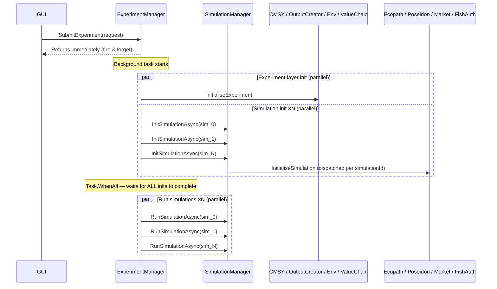
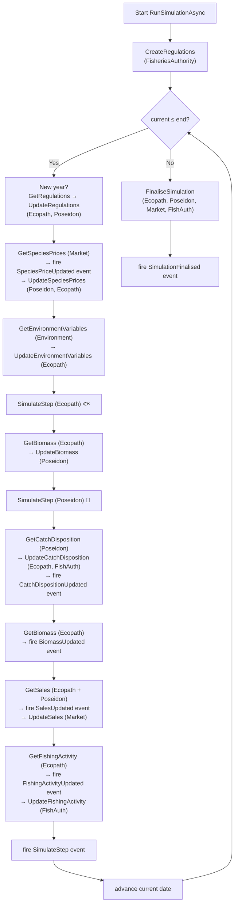
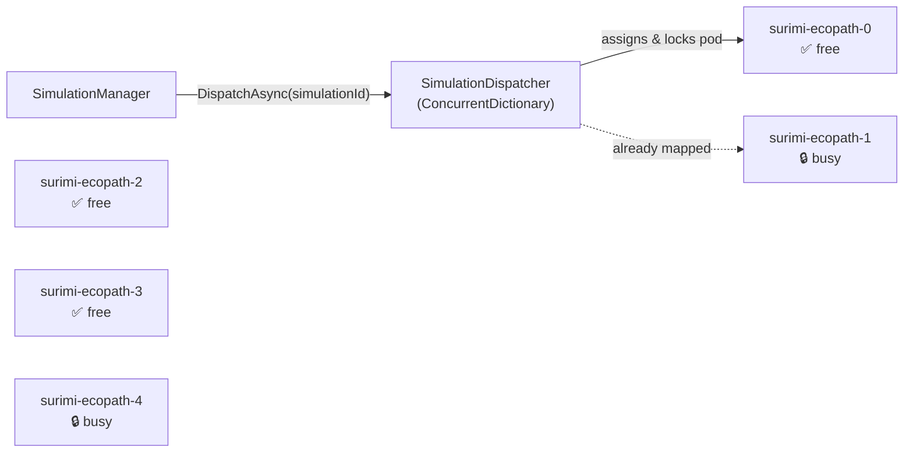
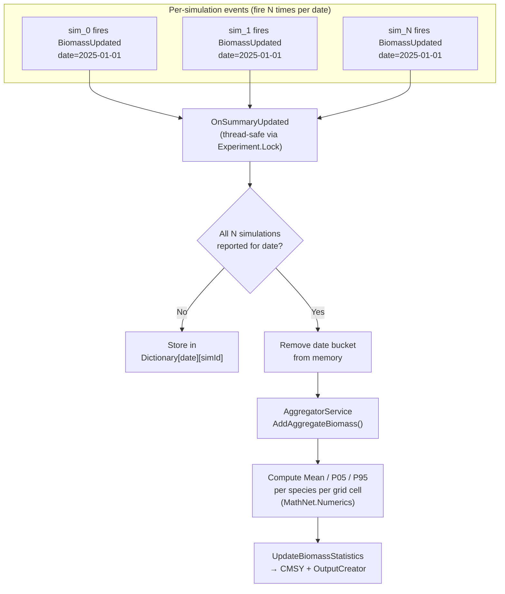
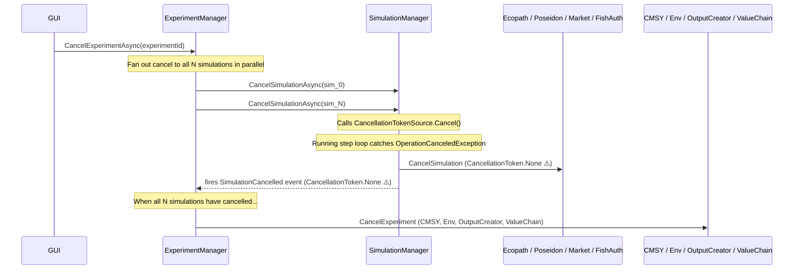
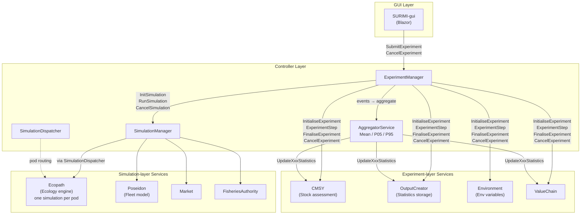
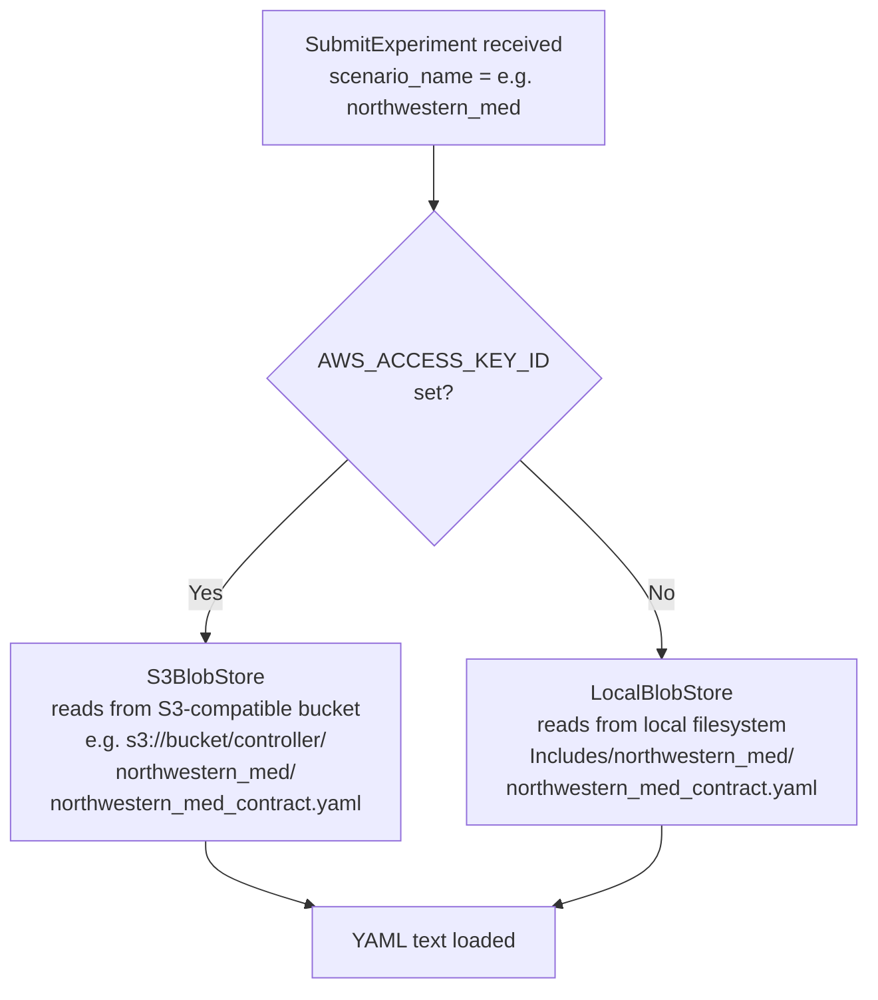
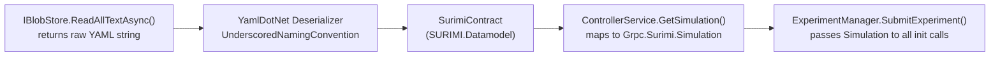
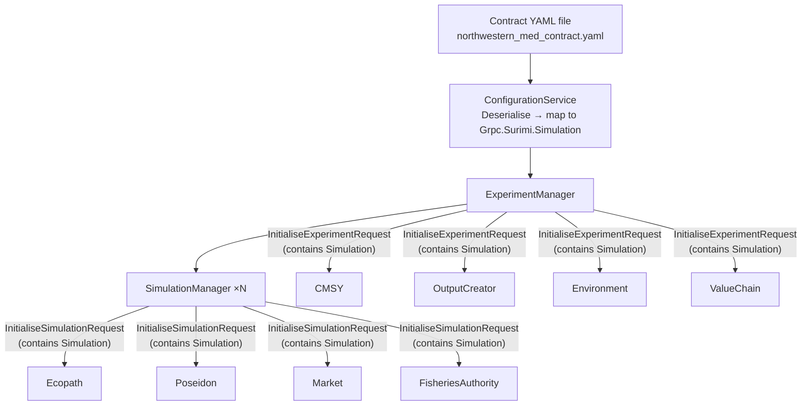

# SURIMI Controller — Simulation Architecture

## 1. Background: Management Strategy Evaluation (MSE)

**Management Strategy Evaluation** is a scientific methodology used in fisheries management to test whether a proposed regulatory strategy (e.g. catch quotas, gear restrictions) is *robust*. Instead of running a single deterministic simulation, MSE deliberately runs the same scenario **N times in parallel**, each with slightly different starting conditions or random perturbations. By looking at the spread of the results across those N runs you can make probabilistic statements:

> *"Under this strategy, mean biomass after 10 years is X, with a 90% confidence interval of [P05, P95]."*

This is the fundamental reason SURIMI uses an **Experiment → many Simulations** structure.

---

## 2. Structural Overview

```
Experiment (1)
 └─ Simulation (N)   ← N parallel runs, each slightly different
```

| Concept | Class | Scope |
|---|---|---|
| **Experiment** | `Experiment` (model), managed by `ExperimentManager` | Across all N runs |
| **Simulation** | `Simulation` (model), managed by `SimulationManager` | Per individual run |

Experiments are stored in a `ConcurrentDictionary<string, Experiment>` keyed by `ExperimentId`. Each `Experiment` holds the list of `SimulationIds` belonging to it.

---

## 3. Service Ownership: Experiment-layer vs Simulation-layer

Services are divided by whether they operate once per *experiment* or once per *simulation run*.

### Experiment-layer clients (one instance shared across all runs)
These are initialised and called through `ExperimentManager`:

| Client | Role |
|---|---|
| `ICmsyServiceClient` | Stock assessment; receives aggregated biomass & catch-disposition statistics per time-step |
| `IOutputCreatorServiceClient` | Stores all statistics output; receives all `UpdateStatistics` messages |
| `IEnvironmentServiceClient` | Provides environmental variables (sea temperature, etc.) per time-step; also participates in experiment step/finalise/cancel |
| `IValueChainServiceClient` | Receives aggregated sales statistics; participates in finalise/cancel |

### Simulation-layer clients (called per individual simulation run)
These are called through `SimulationManager`, once per simulation ID:

| Client | Role |
|---|---|
| `IEcopathServiceClient` | Ecology engine — runs the core ecosystem model. **One simulation at a time per pod** (see §6) |
| `IPoseidonServiceClient` | Fishing fleet model — computes catch disposition and fishing activity |
| `IMarketServiceClient` | Market model — provides species prices and processes sales |
| `IFisheriesAuthorityServiceClient` | Regulatory model — provides and enforces fishing regulations |

---

## 4. Lifecycle: Initialisation → Run

The lifecycle is strictly **two-phased**: everything must be fully initialised before anything runs.



Key points:
- `SubmitExperiment` returns **immediately** to avoid gRPC timeout; all work happens in a background `Task`.
- Experiment-layer inits and all N simulation inits are launched **concurrently** using `Task.WhenAll`.
- `RunSimulationAsync` is only called after **every single** init task has completed successfully.
- If any init fails, the whole experiment fails (exception is logged and re-thrown).

---

## 5. Per-Simulation Step Loop

Each simulation runs an independent time-step loop inside `SimulationManager.RunSimulationAsync`. The steps within one simulation are sequential (each call depends on the previous result), but the N simulations run **in parallel with each other**.



---

## 6. Ecopath and the SimulationDispatcher

Ecopath is a computationally intensive ecological modelling engine that can only **run one simulation at a time per process instance**. In the Kubernetes cluster, multiple Ecopath pods are deployed (e.g. `surimi-ecopath-0` … `surimi-ecopath-4`) to allow parallel simulations.

`SimulationDispatcher` acts as a **pod router**:



**Routing rules:**
1. On the **first call** for a `simulationId`, find the first available pod (`podAvailability[pod] == true`).
2. Resolve the pod's DNS address; if DNS resolution fails, throw `StatusCode.Unavailable` (triggers retry in `DispatchWithRetryAsync`).
3. Mark the pod as **busy** (`podAvailability[pod] = false`) and record the mapping in `simulationToPodMap`.
4. On **subsequent calls** for the same `simulationId`, reuse the **same** pod.
5. When the simulation ends or is cancelled, `ReleasePodFromSimulation` sets the pod back to **available**.

> **Dev mode:** When `ECOPATH_URL` does not contain `"pod"` (i.e. running on a developer machine pointing at `localhost`), the dispatcher skips address replacement and DNS checks entirely.

---

## 7. Date-Bucketed Aggregation

Each simulation fires events (`BiomassUpdated`, `CatchDispositionUpdated`, etc.) independently as it completes a time step. `ExperimentManager` must wait until **all N simulations** have reported for the same date before computing statistics.



**Thread safety:** All writes to the per-date dictionaries are protected by `Experiment.Lock` (a C# 13 `Lock` object). The `onAllReceived` callback is fired *outside* the lock to avoid holding it during async gRPC calls.

**Memory management:** Date buckets are removed immediately after aggregation — the controller never accumulates unbounded state.

---

## 8. Aggregated Statistics: What Gets Computed

`AggregatorService` computes three statistics for every numeric field across the N simulation results:

| Statistic | Meaning |
|---|---|
| **Mean** | Expected value of the outcome |
| **P05** (5th percentile) | Pessimistic bound — only 5% of runs fall below this |
| **P95** (95th percentile) | Optimistic bound — only 5% of runs exceed this |

The Mean + P05/P95 band represents the **robustness envelope** of the management strategy.

### Spatial data (Biomass, CatchDisposition)
Iterates every `(latitude, longitude)` cell that appears in *any* simulation, collecting values from all runs (missing cells treated as `0`), then computes statistics with `MathNet.Numerics.Statistics`.

### Non-spatial data (FishingActivity, Sales, SpeciesPrice)
Uses `DistinctBy` on the relevant composite key (fleet segment, species, market) and a direct LINQ loop to collect scalar values across runs.

### UpdateStatistics recipients

| Event | Receives aggregated statistics |
|---|---|
| `BiomassUpdated` | CMSY, OutputCreator |
| `CatchDispositionUpdated` | CMSY, OutputCreator |
| `FishingActivityUpdated` | OutputCreator |
| `SalesUpdated` | OutputCreator, ValueChain |
| `SpeciesPriceUpdated` | OutputCreator |

Only **experiment-layer** clients receive statistics messages. The individual simulation-layer services (Ecopath, Poseidon, Market, FisheriesAuthority) never see aggregated output.

---

## 9. Excluding Clients

Individual service clients implement `ISimulationService.AddInitialise`, which can add an initialisation task to the wait list, if it is not excluded. This means a client can be **excluded from an experiment run** without code changes — only its enabled/disabled configuration needs to be toggled by setting an environment variable, LIKE "EXCLUDE_VALUECHAIN". Disabled clients are silently skipped during every phase: init, step, finalise, and cancel. The exception is POSEIDON. It is excluded automatically depending on the existance of a model with the name "POSEIDON" in the list of Fleet segments in the contract.

---

## 10. Cancellation

Cancellation can be triggered at any time via `CancelExperimentAsync`.



> ⚠️ **Important:** Once the `CancellationTokenSource` has been cancelled, all subsequent cleanup gRPC calls use `CancellationToken.None`. Reusing the already-cancelled token would cause those calls to fail immediately with `StatusCode.Cancelled` before reaching the wire — the cleanup messages would never be delivered.

Pending `SimulateStep` and summary events that arrive after cancellation are **silently dropped** — the guard `!e.Token.IsCancellationRequested` prevents partial statistics from being forwarded during a cancel.

---

## 11. Full Architecture Diagram



---

## 12. The SURIMI Contract

### 12.1 Purpose

Before any simulation can start, every service must agree on a shared set of domain rules: which species exist, which fleet segments operate, which markets and currencies are in scope, what the spatial grid looks like, what the time range is, and which unit standards to use. This shared agreement is called the **SURIMI Contract**. It is a YAML file that is authoritative for one scenario.

A mismatch between a service's internal configuration and the contract (e.g. an unknown species code, an unsupported fleet segment) causes that service to throw a gRPC exception during initialisation, which immediately aborts the experiment.

### 12.2 Scenarios

SURIMI ships with three named scenarios, each with its own contract file:

| Scenario name | Description |
|---|---|
| `northwestern_med` | North-Western Mediterranean case study |
| `aegean_sea` | Aegean Sea case study |
| `anchovy_bay` | Anchovy Bay case study |

The scenario to use is supplied by the GUI as the `scenario_name` field of the `SubmitExperimentRequest`.

### 12.3 Where the Contract File Lives

The contract file is resolved at runtime via `IBlobStore`, which abstracts over two storage backends depending on the environment:



| Environment variable | Presence | Effect |
|---|---|---|
| `AWS_ACCESS_KEY_ID` | Set | S3-compatible storage is used (`AWS_S3_ENDPOINT`, `AWS_SECRET_ACCESS_KEY`, `AWS_BUCKET_NAME` also required) |
| `AWS_ACCESS_KEY_ID` | Absent / empty | Falls back to the local `Includes/` directory (developer mode or disconnected environment) |

The file path pattern is always: `{scenarioName}/{scenarioName}_contract.yaml` — e.g. `northwestern_med/northwestern_med_contract.yaml`.

If the file cannot be found in either location, a `StatusCode.Internal` gRPC exception is thrown immediately and the experiment does not start.

### 12.4 Loading and Deserialisation

`ConfigurationService.ReadConfigurationAsync` handles the full loading pipeline:



1. The YAML is deserialised by **YamlDotNet** using `UnderscoredNamingConvention` (snake_case keys map to PascalCase C# properties).
2. `ControllerService.GetSimulation()` maps the `SurimiContract` (SURIMI.Datamodel types) to the `Grpc.Surimi.Simulation` protobuf message. This includes geography, time range, standards, species list, fleet segments, markets, currencies, and price categories.
3. The resulting `Simulation` message is passed to `ExperimentManager.SubmitExperiment()`, which includes it verbatim in every `InitialiseExperimentRequest` (experiment-layer) and every `InitialiseSimulationRequest` (simulation-layer).

### 12.5 Contract Distribution

Once deserialised and mapped, the contract is broadcast to all services during the initialisation phase (see §4):



Every service — both experiment-layer and simulation-layer — receives the full `Simulation` message as part of its `Initialise` call. If a service cannot satisfy the contract (unknown species, unsupported gear, incompatible grid resolution, etc.) it throws a gRPC exception. Because all init calls are awaited via `Task.WhenAll`, a single failure aborts the entire experiment before any simulation step is ever executed.
